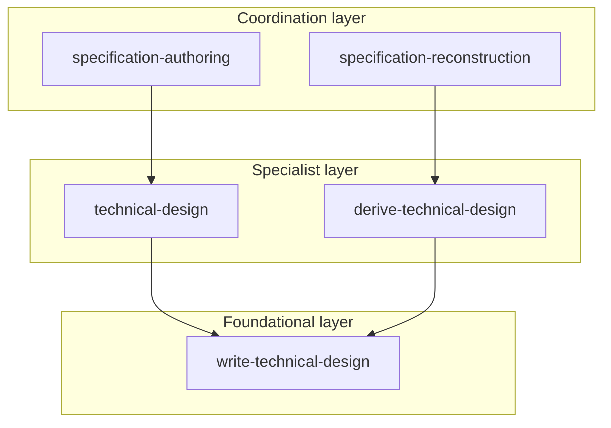
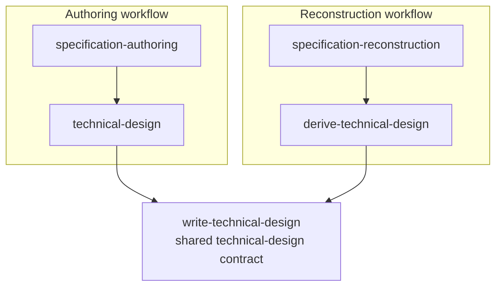

# Layer hierarchy

`agent-skills-pack` uses a strict 3-layer model so the same artifact contracts can survive across authored and reconstructed workflows.

The layers are:

1. **coordination**
2. **specialist**
3. **foundational**

This is not just directory organization. The split preserves:

- clear ownership
- composability
- reversibility
- predictable routing
- stable artifact contracts across workflows

## At a glance

Dependency direction is one-way:

- **foundational** skills are reusable leaves
- **specialist** skills apply foundational contracts to one bounded job
- **coordination** skills sequence specialist work across a full workflow

That means:

- foundational skills do not depend on other skills
- specialist skills depend on foundational skills
- coordination skills depend on specialist skills for artifact-producing work

## What each layer owns

| Layer | Owns | Must not own |
| --- | --- | --- |
| **foundational** | shared artifact contracts, required sections, templates, validators, naming, provenance mechanics | authored workflow sequencing, reconstruction workflow sequencing, workflow root identity, workflow-wide lineage policy |
| **specialist** | one bounded artifact job or bounded analysis/planning job | shared canonical contract for the artifact type, workflow-wide coordination across multiple artifacts |
| **coordination** | sequencing across artifacts, workflow defaults, root workflow identity, workflow-wide lineage expectations, cross-artifact consistency | reusable leaf artifact contracts, specialist production method details |

## Why the boundaries are strict

If the layers blur, the package stops being reversible.

Typical failure modes:

- a foundational skill starts encoding workflow decisions
- a specialist skill starts redefining a shared artifact contract
- a coordination skill starts copying artifact rules instead of routing through specialists
- authored and reconstructed versions of the same artifact type drift into different structures

The package avoids that by keeping each layer narrow.

## Concrete example: technical design across two workflows

The clearest example is the technical-design family.

### Foundational: `write-technical-design`

`write-technical-design` owns the shared technical-design artifact contract.

It defines things like:

- canonical section order
- required diagram slots
- validator behavior
- shared template expectations
- technical-design content boundaries

It does **not** decide:

- whether the design is authored or reconstructed
- when technical design happens in a workflow
- what the workflow-level `source_artifacts` policy is
- whether this run belongs to specification authoring or specification reconstruction

### Specialist: `technical-design`

`technical-design` is the authored specialist.

It owns one bounded job:

- produce `technical-design.md` from approved specification context and repository evidence

It uses the shared `write-technical-design` contract, but it does not redefine that contract.

Its framing is authored design work from approved upstream artifacts such as:

- `./charter.md`
- `./user-stories.md`
- `./requirements.md`

### Specialist: `derive-technical-design`

`derive-technical-design` is the reconstruction specialist.

It owns one different bounded job:

- reconstruct `technical-design.md` from repository evidence and reconstructed specification context

It also uses the same `write-technical-design` contract, but under different reasoning constraints:

- repository evidence is primary
- observed architecture must be separated from inferred rationale
- weak conclusions must stay explicit as `TODO: Confirm`

### Coordination: `specification-authoring` and `specification-reconstruction`

The coordination skills sit above both specialists.

They decide things like:

- which workflow is running
- where the spec pack root lives
- what `generated_by.root_skill` should be
- what canonical `source_artifacts` lineage each artifact should carry
- when `technical-design.md` is produced relative to charter, stories, and requirements

They do **not** replace the technical-design contract and they do **not** replace the specialist method.

## Workflow view of the same example

This shows the key architectural point:

- two different specialist workflows
- one shared foundational contract

That is how the package keeps technical-design artifacts compatible across authored and reconstructed runs.

## Why this improves reversibility

### Shared contract, multiple workflows

`write-technical-design` keeps the technical-design artifact stable whether the document is:

- authored from approved specification artifacts, or
- reconstructed from repository evidence

Because the contract is shared, the pack can move between authored and reconstructed forms without changing the artifact shape.

### Specialist jobs stay narrow

`technical-design` and `derive-technical-design` are separate because they have different sources of truth.

- `technical-design` works from approved specification context
- `derive-technical-design` works from implemented reality

If they were merged, the skill would blur authored intent and observed evidence. Keeping them separate makes routing and review more predictable.

### Coordination stays above artifact production

`specification-authoring` and `specification-reconstruction` decide when technical design happens in each workflow, but they do not own the technical-design contract itself.

That separation keeps:

- workflow sequencing in coordination
- artifact production in specialist skills
- shared structure and validation in foundational skills

## How to reason about dependency direction

Use this mental model:

- **coordination asks for bounded artifact work**
- **specialist applies a shared contract**
- **foundational defines the reusable contract**

In the technical-design example:

- `specification-authoring` calls `technical-design`
- `specification-reconstruction` calls `derive-technical-design`
- both specialists rely on `write-technical-design`

The dependency arrow always points downward toward narrower, more reusable contracts.

## The same pattern appears across the repo

The technical-design family is not a special case. It demonstrates the package-wide model used across artifact families such as:

- charter
- user stories
- requirements
- technical design
- execution planning
- task tracking

A good default question is:

1. Is this a shared artifact contract? -> **foundational**
2. Is this one bounded way of producing or analyzing that artifact? -> **specialist**
3. Is this sequencing multiple specialists across a workflow? -> **coordination**

## Practical rule of thumb

When updating or adding a skill:

- put shared templates, validators, and canonical structure in **foundational**
- put one bounded artifact job in **specialist**
- put workflow sequencing, pack roots, and lineage defaults in **coordination**

If one skill seems to need all three, split it.