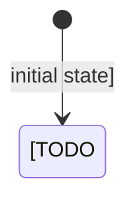

## Architecture Summary

[TODO: summarize the system shape and the main architectural approach.]

## System Context

- [TODO: upstream system, user surface, runtime environment, or external boundary]

### Context Flowchart

```mermaid
flowchart TD
  [TODO: add system context or process flow]
```

Or:

- Not needed: [TODO: explain why a flowchart would not add clarity here]

## Components and Responsibilities

### Behavior State Diagram



Or:

- Not needed: [TODO: explain why no meaningful lifecycle or state model exists]

### [TODO: Component name]

- Responsibility: [TODO: owned behavior]
- Inputs: [TODO: upstream inputs]
- Outputs: [TODO: downstream outputs]

## Data Model and Data Flow

- Entities: [TODO: main entities or records]
- Flow: [TODO: how data moves through the system]

### Entity Relationship Diagram

```mermaid
erDiagram
  [TODO: add persistent entities and relationships]
```

Or:

- Not needed: [TODO: explain why persistent entity relationships are not central here]

## Interfaces and Contracts

- [TODO: API, service, event, storage, or module contract]

### Interaction Diagram

```mermaid
sequenceDiagram
  participant [TODO: actor]
  participant [TODO: system]
```

Or:

- Not needed: [TODO: explain why interaction ordering would not add clarity here]

## Integration Points

- [TODO: integration point and expectation]

## Failure and Recovery Strategy

- [TODO: failure mode and handling strategy]

## Security, Reliability, and Performance

- [TODO: operational qualities and constraints]

## Implementation Strategy

- [TODO: implementation approach, sequencing assumptions, and boundary choices]

## Testing Strategy

- [TODO: unit, integration, end-to-end, or contract testing approach]

## Risks and Tradeoffs

- [TODO: key risk or tradeoff]

## Further Notes

- Assumptions: [TODO: list assumptions or `None`]
- Open questions: [TODO: list open questions or `None`]
- TODO: Confirm: [TODO: unresolved high-impact detail or `None`]
