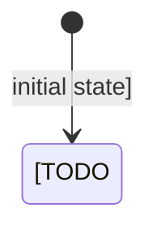

> For derived design, recover the runtime architecture the code proves. Name execution-relevant constraints, ownership, and escape hatches without turning the document into a directory tour.

## Architecture Summary

- Runtime profile: [TODO: CLI-only / server-only / browser-only / multi-runtime / `TODO: Confirm`]
- Composition root: [TODO: entrypoint, main layer, or `TODO: Confirm`]
- Main execution model: [TODO: main loop, request flow, batch run, or other observed model]
- Summary: [TODO: summarize the system shape, the main architectural approach, and the user-visible behaviors the design must support]

## System Context

- [TODO: upstream system, user surface, runtime environment, or external boundary]
- Story or requirements traceability: [TODO: relevant capability areas, story titles, or requirement IDs]

### Context Flowchart

```mermaid
flowchart TD
  [TODO: add system context or process flow]
```

Or:

- Not needed: [TODO: explain why a flowchart would not add clarity here]

## Components and Responsibilities

### Behavior State Diagram



Or:

- Not needed: [TODO: explain why no meaningful lifecycle or state model exists]

### [TODO: Component name]

- Boundary type: [TODO: command handler / service / layer / parser / validator / adapter]
- Owned capability: [TODO: bounded responsibility]
- Hidden depth: [TODO: policy, workflow, or lifecycle complexity hidden behind the boundary]
- Inputs: [TODO: upstream inputs]
- Outputs: [TODO: downstream outputs]
- Story impact: [TODO: relevant story behavior or requirement IDs]

## Data Model and Data Flow

- Entities: [TODO: main entities, records, or document variants]
- Flow: [TODO: how data moves through the system]
- Observation support: [TODO: how visible outcomes, feedback, or state signals are produced]

### Entity Relationship Diagram

```mermaid
erDiagram
  [TODO: add persistent entities and relationships]
```

Or:

- Not needed: [TODO: explain why persistent entity relationships are not central here]

## Interfaces and Contracts

- Interface: [TODO: API, service, event, storage, or module contract]
- Accepted input grammar: [TODO: CLI, URL, file, schema, or other grammar rule]
- Validation rules: [TODO: strict, tolerant, required fields, or boundary checks]
- Boundary errors: [TODO: tagged errors, schema errors, thrown errors, or `TODO: Confirm`]
- Trigger and boundary conditions: [TODO: relevant situations, preconditions, or edge cases]

### Interaction Diagram

```mermaid
sequenceDiagram
  participant [TODO: actor]
  participant [TODO: system]
```

Or:

- Not needed: [TODO: explain why interaction ordering would not add clarity here]

## Integration Points

- [TODO: integration point, protocol, and expectation]

## Failure and Recovery Strategy

- Error model: [TODO: tagged errors, schema errors, thrown errors, or `TODO: Confirm`]
- Degraded modes and recovery: [TODO: visible failure conditions, fallback behavior, retries, or recovery observations]

## Security, Reliability, and Performance

- [TODO: operational qualities and constraints]

## Implementation Strategy

- Recomposition sites: [TODO: composition root, dependency-wiring sites, or layer assembly points]
- Resource ownership: [TODO: temp dirs, child processes, scoped resources, or `Not needed`]
- Direct runtime escape hatches: [TODO: direct host-runtime APIs, thrown errors, or `Not needed`]
- Strategy: [TODO: implementation approach, sequencing assumptions, and boundary choices]

## Testing Strategy

- [TODO: unit, integration, end-to-end, or contract testing approach]
- Verification focus: [TODO: how key outcomes, grammars, and observations will be verified]

## Risks and Tradeoffs

- [TODO: key risk or tradeoff]

## Further Notes

- Assumptions: [TODO: list assumptions or `None`]
- Open questions: [TODO: list open questions or `None`]
- TODO: Confirm: [TODO: unresolved high-impact detail or `None`]
